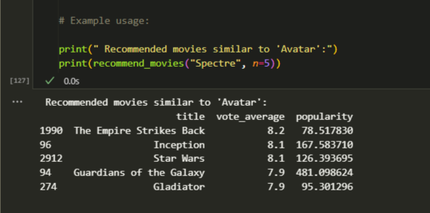
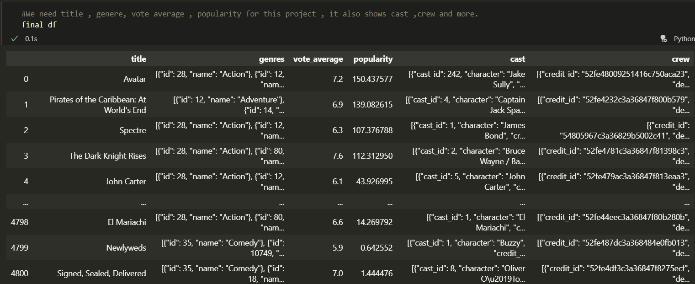
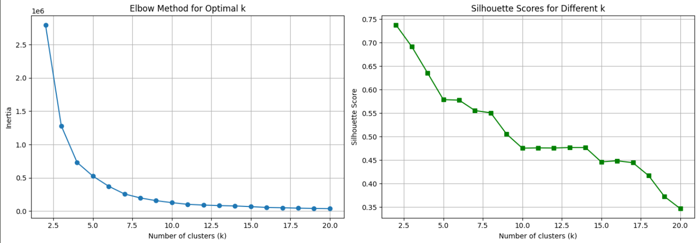
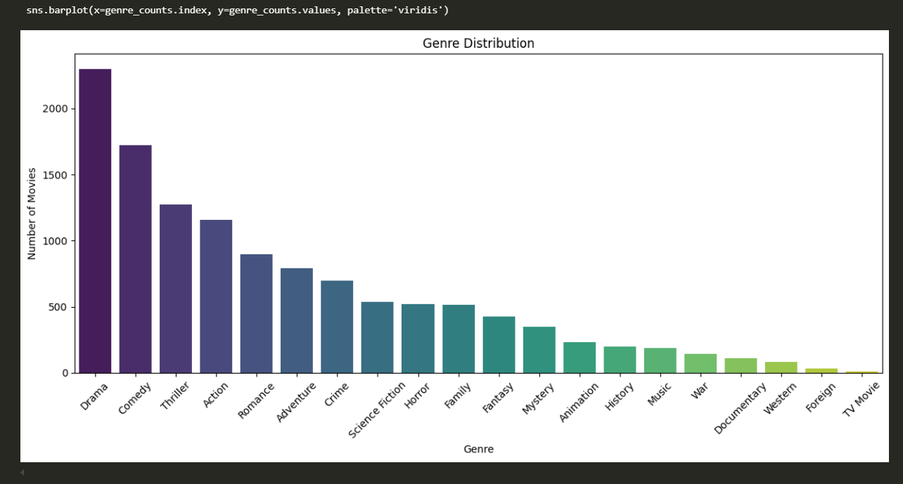
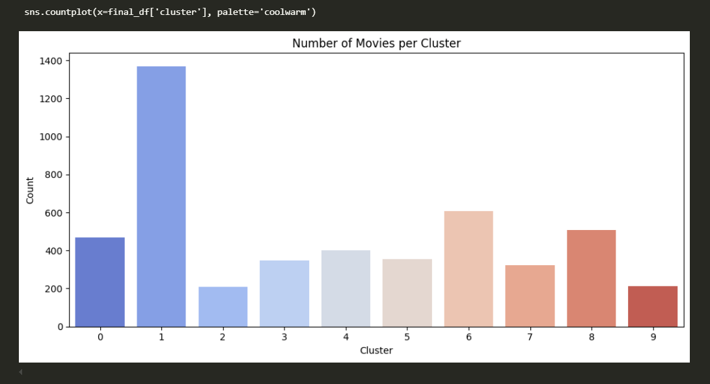
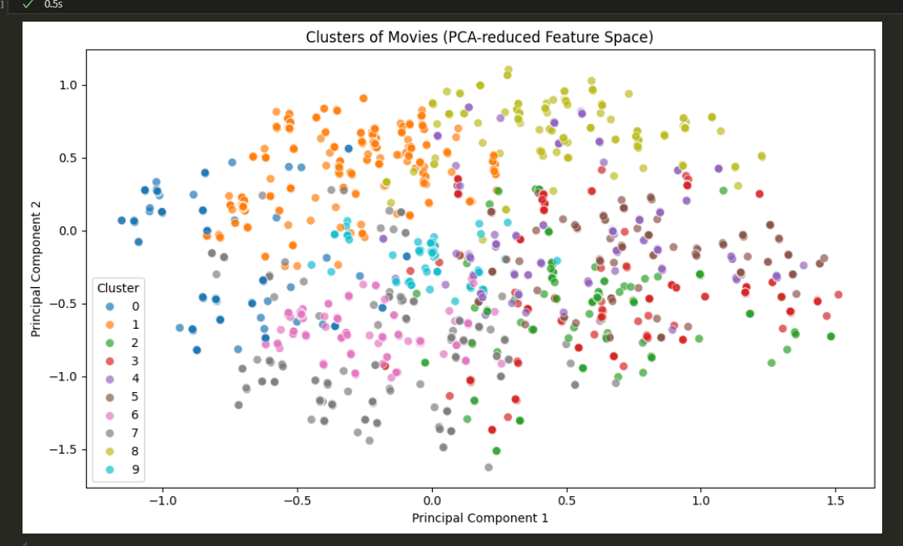

# 🎬 TMDB Movie Recommendation System

Welcome to my movie recommendation engine! This project uses real-world data from TMDB (The Movie Database) to recommend similar movies based on what you've already liked. Whether you're into action-packed thrillers or heartwarming dramas, this system will help you discover your next favorite.

---

## 🧠 What it does

- Combines TMDB movie and credits datasets
- Cleans and merges data for rich context
- Uses NLP techniques and cosine similarity for recommendations
- Returns top 5 similar movies when you input a title

---

## 📸 Demo / Output Preview

Here's a sneak peek of the final output:

> You can try it with titles like `Inception`, `Avatar`, `The Dark Knight`, etc.

finaldf image is the merged csv file .

 

**Elbow Method** (Inertia vs k)
**Silhouette Score** (Silhouette Score vs k) 

Genre Distribution (Top 5)
1. Action (34.6%)
2. Adventure (23.1%)
3. Sci-Fi (20.5%)
4. Thriller (14.5%)
5. Drama (7.3%)

CLUSTERS:

Cluster 1: 0.5% (Action, Adventure)
Cluster 2: 0.5% (Thriller, Drama)
Cluster 3: 0.5% (Sci-Fi, Action)
Cluster 4: 0.5% (Adventure, Thriller)
Cluster 5: 0.5% (Drama, Sci-Fi)

Barplot : 

Scatter Plot: 

---

## 🛠️ Tools & Libraries Used

- Python
- Pandas, NumPy
- Scikit-learn (for vectorization and similarity)
- Jupyter Notebook

---

## 🔁 How to Run

1. Clone this repo  
   `git clone https://github.com/lakshmitulasimandala/TMDB-MOVIE-RECOMMENDATION.git`

2. Activate the environment or install dependencies  
   *(All installations are inside the notebook itself)*

3. Open the notebook and run all cells  
   File: `netflix_recomm.ipynb`

---

## 🌟 What's Next?

- Adding genre or actor-based filtering
- Deploying with a web interface using Streamlit or Flask
- Option to recommend based on multiple movies

---

## 📬 Feedback?

Found it interesting or have suggestions? I'd love to hear from you!  
Drop a ⭐ if you liked it, or raise an issue if something's off.

---

Made with ❤️ by Tulasi
